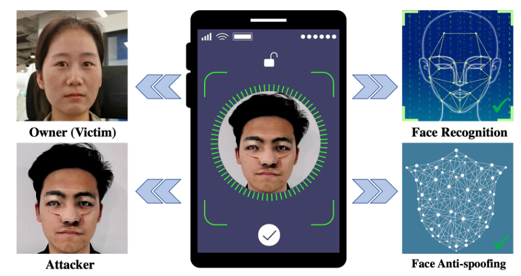

# Towards Effective Adversarial Textured 3D Meshes on Physical Face Recognition 

[Towards Effective Adversarial Textured 3D Meshes on Physical Face Recognition](https://arxiv.org/abs/2303.15818) (CVPR 2023, <font color="red"> Highlight </font>)

[Xiao Yang](https://ml.cs.tsinghua.edu.cn/~xiaoyang/), Chang Liu, Longlong Xu, [Yikai Wang](https://yikaiw.github.io/), [Yinpeng Dong](http://ml.cs.tsinghua.edu.cn/~yinpeng/), [Ning Chen](https://scholar.google.com/citations?user=cSxeVz0AAAAJ&hl=en), [Hang Su](http://www.suhangss.me/), and [Jun Zhu](http://ml.cs.tsinghua.edu.cn/~jun/index.shtml).


<p align="center"> 

</p>
<p align="center">Demonstration of physical black-box attacks for unlocking one prevailing mobile phone. <p align="center">

## Getting Started

Clone the repository using the following command:

```bash
git clone --recursive https://github.com/thu-ml/AT3D.git
```

### Prerequisite Models
Before using this code for the attack, you need to set up the environment for data preprocessing. In the directory `preprocess/get_bfm_mat/Deep3DFaceRecon_pytorch`, you must prepare some prerequisite models:

1. Based on the previous work by [Deng et al.](https://arxiv.org/abs/1903.08527), we use [Basel Face Model 2009 (BFM09)](https://faces.dmi.unibas.ch/bfm/main.php?nav=1-0&id=basel_face_model) to represent 3d faces. Get access to BFM09 using this [link](https://faces.dmi.unibas.ch/bfm/main.php?nav=1-2&id=downloads) and download "01_MorphableModel.mat". In addition, we use an Expression Basis provided by [Guo et al.](https://github.com/Juyong/3DFace). Download the Expression Basis (Exp_Pca.bin) using this [link (google drive)](https://drive.google.com/file/d/1bw5Xf8C12pWmcMhNEu6PtsYVZkVucEN6/view). Organize all files into the following structure:

    ```
    AT3D
    ├── preprocess
            │
            └── get_bfm_mat
                    │
                    └── Deep3DFaceRecon_pytorch
                        │
                        └─── BFM
                            │
                            └─── 01_MorphableModel.mat
                            │
                            └─── Exp_Pca.bin
                            |
                            └─── ...
    ```
2. Download the pre-trained model using this [link (google drive)](https://drive.google.com/drive/folders/1liaIxn9smpudjjqMaWWRpP0mXRW_qRPP) and organize the directory into the following structure:

    ```
    AT3D
    ├── preprocess
        │
        └── get_bfm_mat
            │
            └── Deep3DFaceRecon_pytorch
                │
                └─── checkpoints
                     │
                     └─── face_recon
                          │
                          └─── epoch_20.pth

    ```

3. Download the topology matrix of different shapes using this [link (google drive)](https://drive.google.com/file/d/10scXpVnxMNNHqsdVThSYVvJP4oa20n7i/view?usp=share_link) and organize the directory into the following structure:

    ```
    AT3D
    ├── data
        ├── BFM_model_front_patch.mat
        └── demo
            ├── origin
            └── results
    
    ```

### Environment

To install the specific python environment, run `conda env create -f environment.yml`.

To prepare the input data for the attack, you should first run `run_preprocess.sh`.

```bash
bash ./run_preprocess.sh
```

If the shell script is successfully executed, you will have following outputs, which will be the required inputs for the attack.

- The coordinates of five landmarks detected for the original picture, *e.g.* `/data/demo/origin/54/detection_54.txt`
- The BFM reconstruction coefficients for every identity in pictures under `/data/demo/origin`, *e.g.* `/data/demo/origin/54/54.mat`
- 224x224 picture output by the reconstruction model. *e.g.* `/data/demo/origin/54/final_54.png`
- The align matrices for the 224x224 picture output by reconstruction model, *e.g.* `/data/demo/origin/54/align_final_54.npz` (if you apply the matrices to the picture, it will scale to 112x112 (or 112x96).)
- The embeddings/features output by different face recognition models (now we only save the results of `ArcFace`, `CosFace` and `ResNet`), *e.g.* `/data/demo/origin/54/embedding_final_54.npz`


### Attack Configuration
To implement an attack, you should add attack pairs in configuration files, *e.g.* `pairs_patch.txt`. Configuration files for different attack methods may have different formats.

```
[the path of the attacker's 224x224 picture output by reconstruction model] [the path of the victim's 224x224 picture output by reconstruction model] [the path of the align matrix of the attacker] [the path of the 3dmm coefficients of the attacker] [the path of the 3dmm coefficients of the victim] [the path of npz file which contains the embeddings (output by different face recognition models) of the victim]
```
To see how to write a configuration file for an attack, you can refer to `/data/demo/pairs_patch.txt`.


## Attack

```bash
# run 2D attack using MIM method
bash ./run_attacks_2D_MIM.sh
# run 2D attack using MIM method with EOT
bash ./run_attacks_2D_EOT.sh
# run 3D attack with perturbation directly on mesh
bash ./run_attacks_AT3DM.sh
# run 3D attack with perturbation directly on mesh, considering smoothing loss
bash ./run_attacks_AT3DML.sh
# run 3D attack with perturbation on 3DMM coefficients
bash ./run_attacks_AT3DP.sh
```
You can see the attack results under `/data/demo/results`. The directory of attack results will be:

```
/data/demo/results/[attack method]/[patch shape]/[attacker's name]/[victim's name]/
```

Under the directory, you will find two pictures generated during the attack process. One is the adversarial example shown in a two-dimension way, the other is a concatenated picture of the attacker, victim and the adversarial example. If you don't want the concatenated picture, just modify the corresponding bash script and set the `--visualize` argument to be `False`.

 In addition, you can see the result `obj` file if you perform a 3D attack. You can open it with a 3D viewer, such as [MeshLab](https://github.com/cnr-isti-vclab/meshlab).

## Citation

If you find our work useful to your research, please consider citing:

```
@article{yang2023towards,
  title={Towards Effective Adversarial Textured 3D Meshes on Physical Face Recognition},
  author={Yang, Xiao and Liu, Chang and Xu, Longlong and Wang, Yikai and Dong, Yinpeng and Chen, Ning and Su, Hang and Zhu, Jun},
  journal={arXiv preprint arXiv:2303.15818},
  year={2023}
}
```

The face images in `/data/demo/origin` are from the public [LFW](http://vis-www.cs.umass.edu/lfw/) dataset released by UMass.

## Acknowledgements
Here are some great resources we benefit:  
- [Deep3DFaceRecon_pytorch](https://github.com/sicxu/Deep3DFaceRecon_pytorch) for representing 3d faces
